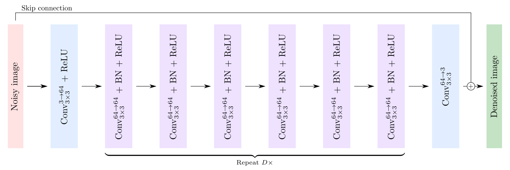
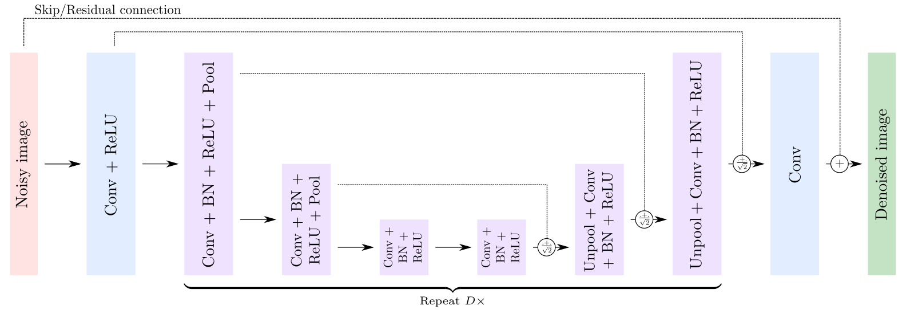
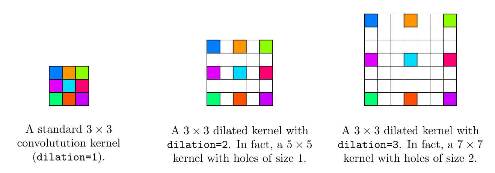

# Image-Denoising-with-Deep-CNNs

This project studies deep convolutional neural networks for image denoising under controlled synthetic degradation settings.
Details in [`tutorial.ipynb`](src/tutorial.ipynb).

 A Study of Model Behavior and Generalization

## 📌 Overview

This project investigates the behavior of deep convolutional neural networks for image denoising under **synthetic degradation settings**.

Rather than focusing solely on performance, this work explores:
- how denoising models behave under different noise conditions,
- their ability to generalize across noise distributions,
- and the trade-offs between model complexity and restoration quality.

The study is inspired by recent research directions in **data-centric learning** and **understanding deep models beyond empirical performance**.

---

## 🎯 Objectives

The main goals of this project are:

- To implement and evaluate deep CNN-based image denoising models
- To simulate controlled degradation using **synthetic noise**
- To analyze model performance and **failure cases**
- To study the **impact of model architecture on restoration quality**
- To explore **generalization across noise levels**

---

## 🧠 Methodology

### 1. Synthetic Data Generation

Clean images from the BSD dataset are degraded using controlled Gaussian noise:

- Noise model: additive Gaussian noise
- Noise level controlled via parameter `σ`
- Enables systematic evaluation across different degradation intensities

This setup allows full control over the data distribution, which is essential for analyzing model behavior.

---


### 2. Models

The following architectures are implemented and compared:

- **DnCNN**: standard deep convolutional denoising network
- **UDnCNN**: U-shaped variant with pooling/unpooling
- **DUDnCNN**: dilated convolution variant for larger receptive fields


## Model Architecture

1. DnCNN



2. UDnCNN


3. DUDnCNN (Dilated U-shaped DnCNN)

Each convolution placed after `k` pooling and `l` unpooling in the network, should be replaced by a dilated filter with 2^(k−l) − 1 holes. This can be achieved with the dilation optional argument of `nn.Conv2d`. Make sure set up the argument padding accordingly to maintain tensors with the same spatial dimension during the forward propagation.



These models differ in:
- depth
- receptive field
- architectural complexity

---


## Dataset

Images from [Berkeley Segmentation Dataset and Benchmark](https://www2.eecs.berkeley.edu/Research/Projects/CS/vision/bsds/).  

* Download here: [https://www2.eecs.berkeley.edu/Research/Projects/CS/vision/bsds/BSDS300-images.tgz](https://www2.eecs.berkeley.edu/Research/Projects/CS/vision/bsds/BSDS300-images.tgz)

It contains two sub-directories: `train` and `test`, which consist of 200 and 100 images, respectively, of either size `321 × 481` or `481 × 321`. While we saw that thousand to millions of images were required for image classification, we can use a much smaller training set for image denoising. This is because denoising each pixel of an image can be seen as one regression problem. Hence, our training is in fact composed of `200 × 321 × 481` **≈ 31 million** samples.


## 3. Training Setup

- Framework: PyTorch
- Loss: Mean Squared Error (MSE)
- Optimization: Adam
- Evaluation metric: **PSNR (Peak Signal-to-Noise Ratio)**

---


## Testing Environment  

* Pytorch version: `1.0.0`
* CUDA version: `9.0.176`
* Python version: `3.6.8`
* CPU: Intel(R) Xeon(R) CPU E5-2630 v4 @ 2.20GHz
* GPU: GeForce GTX 1080 Ti (11172MB GRAM)
* RAM: 32GB

## Usage

1. Clone this repository

```bash
git clone https://github.com/lychengr3x/Image-Denoising-with-Deep-CNNs.git
```


### 4. Evaluation Strategy

Models are evaluated under:

- Different noise levels (σ)
- Training vs testing distribution mismatch
- Visual inspection of restored outputs

---

2. Download dataset

```bash
cd Image-Denoising-with-Deep-CNNs/dataset
wget https://www2.eecs.berkeley.edu/Research/Projects/CS/vision/bsds/BSDS300-images.tgz
tar xvzf BSDS300-images.tgz
rm BSDS300-images.tgz
```

3. Train the model

```bash
cd ../src
python main.py
```

**PS**: Read [`argument.py`](src/argument.py) to see what parameters that you can change.  
---

## 📊 Experimental Analysis

This project focuses on **understanding model behavior**, not just reporting metrics.

### 🔍 Key Questions Explored

- How does denoising performance degrade as noise increases?
- Do models trained on a specific noise level generalize to others?
- What types of structures (edges, textures) are harder to restore?
- How does architecture complexity impact performance?

---

### ⚠️ Observations

- Models perform well under **matched training/testing noise conditions**
- Performance drops significantly under **distribution shift**
- Fine textures are harder to reconstruct than smooth regions
- Larger models improve performance but increase computational cost

---

## ⚡ Model Complexity vs Performance

A comparative analysis was conducted between models of varying depth and complexity:

| Model     | Complexity | Performance | Observations |
|----------|----------|------------|-------------|
| DnCNN     | Low      | Moderate   | Fast but limited capacity |
| UDnCNN    | Medium   | Good       | Better spatial modeling |
| DUDnCNN   | High     | Best       | Strong performance, higher cost |

This highlights the trade-off between **frugality** and **accuracy**.

---

## ✍️ Contribution

This project builds upon existing academic implementations and extends them with:

- Additional experimental analysis across noise levels
- Study of generalization under distribution shifts
- Comparative evaluation of model architectures
- Investigation of model behavior and failure cases

## 🚀 Future Work

- Extend to non-Gaussian degradations (blur, compression artifacts)
- Investigate data-driven synthetic generation strategies
- Explore explainability methods for denoising networks
- Study lightweight architectures for efficient deployment


> Note: There *might be* minor mistakes regarding the model architecture in the code.

## References

* https://www.charles-deledalle.fr/pages/files/ucsd_ece285_mlip/assignment4.pdf 
